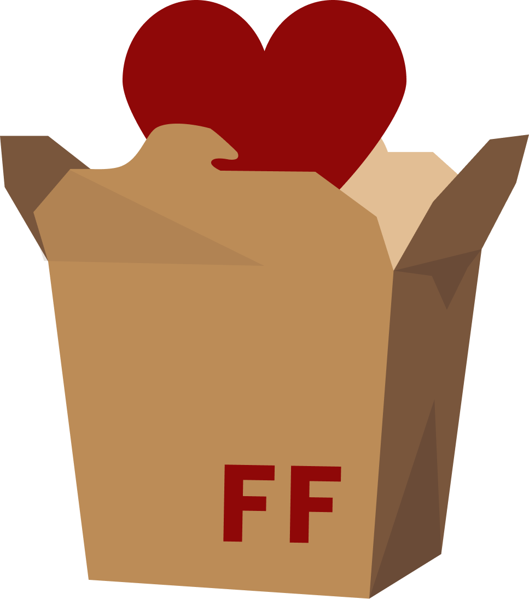

  

# 🚲 Friendly Food

Plataforma de Gestão de Banco de Alimentos
Projeto desenvolvido para o **Desafio de Impacto Social**

## 📚 ESCOPO DO PROJETO

* **Projeto:** Friendly Food
* **Modelo:** Banco de Alimentos Digital

## 👥 GRUPO 01

**Integrantes:**
* Márcia Telles Fogaça
* (Adicione aqui os outros integrantes do seu grupo)

### 1️⃣ Nome do Projeto
**Friendly Food**

### 2️⃣ Modelo do Projeto
API REST para gestão e conexão entre doadores e entidades beneficiadas.

### 3️⃣ Descrição do Projeto
O **Friendly Food** nasceu para combater a insegurança alimentar através da tecnologia. Nossa plataforma gerencia doações de alimentos, garantindo:
* 🍎 Classificação de itens (Perecíveis/Não-perecíveis)
* 📦 Controle rigoroso de estoque
* ⏳ Monitoramento de prazos de validade
* 🤝 Conexão direta com instituições receptoras

### 🛠 4 Tecnologias Utilizadas

| Item | Tecnologia |
| :--- | :--- |
| 🖥 Servidor | Node.js |
| 💻 Linguagem | TypeScript |
| ⚙ Framework | NestJS |
| 🗄 ORM | TypeORM |
| 🗃 Banco de Dados | MySQL |

---

  
  
<b>Organização ON-ToMany</b>

